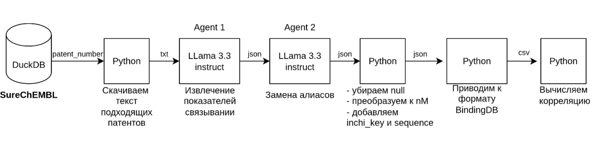

# Automated Extraction of Bioactivity Data (KD, Ki, IC50, EC50)

## Overview

This project presents an **automated algorithm for collecting information about molecular binding measurements**—KD, Ki, IC50, and EC50. The tool is designed to generate large volumes of high-quality data for machine learning model training, supporting further breakthroughs in pharmaceutical and biological research.

## Background

Access to large bioactivity databases, such as **BindingDB** and **ChEMBL**, has already made a significant impact on the development of new drug technologies. These databases are widely used to train modern artificial intelligence models that predict interactions between small molecules and proteins.

However, data collection and annotation for these resources are still largely performed **manually**, which is challenging and time-consuming. Despite these limitations, such databases have enabled the creation of powerful AI models and numerous scientific discoveries.

## Project Goals

* **Automate the extraction and annotation** of molecular binding data (KD, Ki, IC50, EC50) from scientific literature and databases
* **Accelerate the creation of large, diverse datasets** for machine learning and AI applications
* **Support ongoing research** by making curated data more accessible and scalable

## Key Features

* Automated parsing and extraction of affinity measurements (KD, Ki, IC50, EC50)
* Structured output for downstream machine learning workflows
* Scalable and extensible design for integration with existing bioinformatics pipelines

## Impact

Automating bioactivity data extraction will:

* Greatly increase the volume and quality of training data for AI models
* Lower the barrier for researchers to access and use up-to-date datasets
* Enable faster and more efficient drug discovery processes

---

## Module Descriptions



* **downloader** — module for downloading patent text

## Typical Workflow

1. **Set up your environment** (Python 3.10). Install dependencies:

   ```bash
   pip install -r requirements.txt
   ```
2. **Manual preparation of the patent list.** (For demo purposes, you can skip this step and use `example_small_ids.txt` or `example_big_ids.txt` in the next step.)

   * Download the SureChEMBL database and load it into DuckDB.
   * Then run:

     ```bash
     surechembl_db_scripts/read_from_duckdb.py
     ```
   * Then run:

     ```bash
     surechembl_db_scripts/create_patent_lists.py
     ```
3. **Filter and download patents** (you can use `example_small_ids.txt` or `example_big_ids.txt` for demonstration):

   ```bash
   python downloader.py --input_file <patent_list> --output_dir <download_dir>
   ```
4. **Agent for extracting binding metrics from patents.**

   * Under the hood, this agent also replaces metric aliases with molecular names (see next step):

   ```bash
   python get_measure.py --patent_dirs <patent_dir> <binding_data_dir>
   ```
5. **Add InChIKey and sequence by molecule and target names, normalize data, and write the final table:**

   ```bash
   python bindingdb.py <binding_data_dir> <final_table>
   ```

---

**Contributions and feedback are welcome!**
